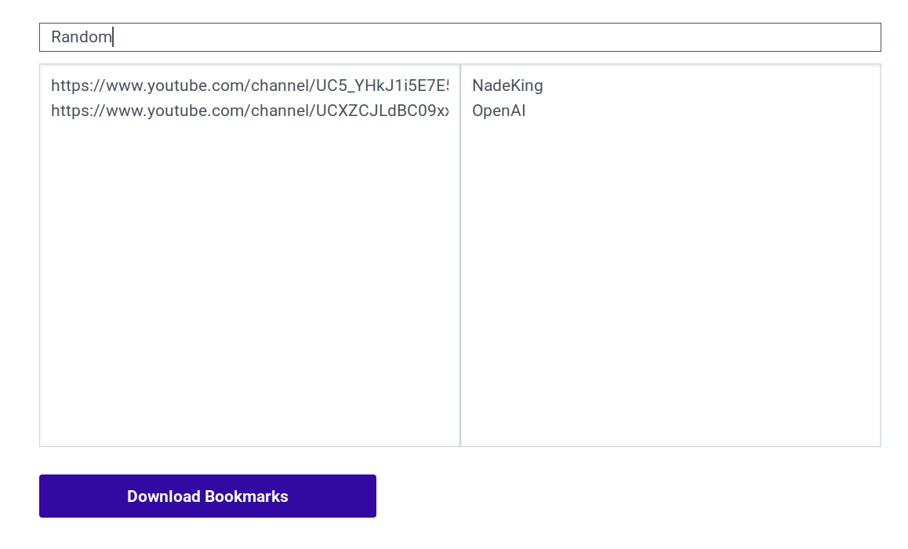
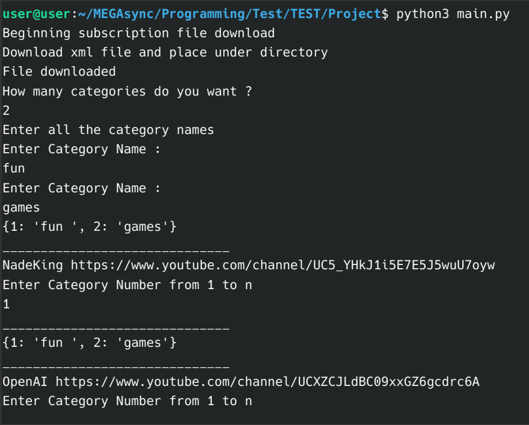

# youtube_subscription_manager
Tool to manage and organize your youtube subscriptions

#How to Use
1) Run the main.py python file
2) The youtube subscription xml file will be downloaded from your google acccount
3) Specifiy number of categories
4) A browser tab will open containing the category wise subscriptitons and an option to download them in html format

